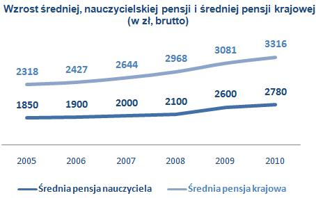
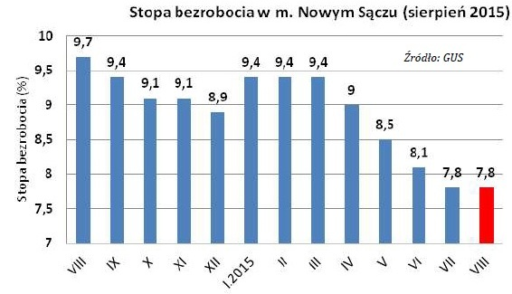
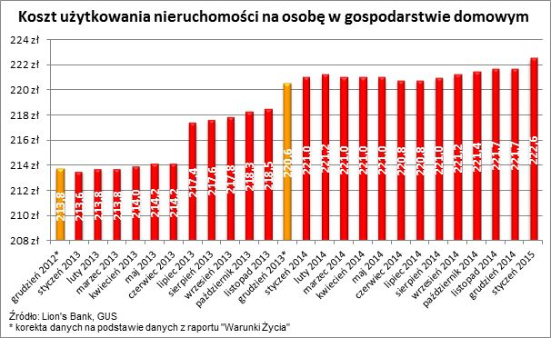
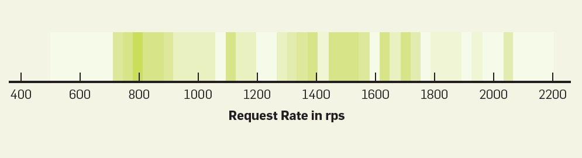
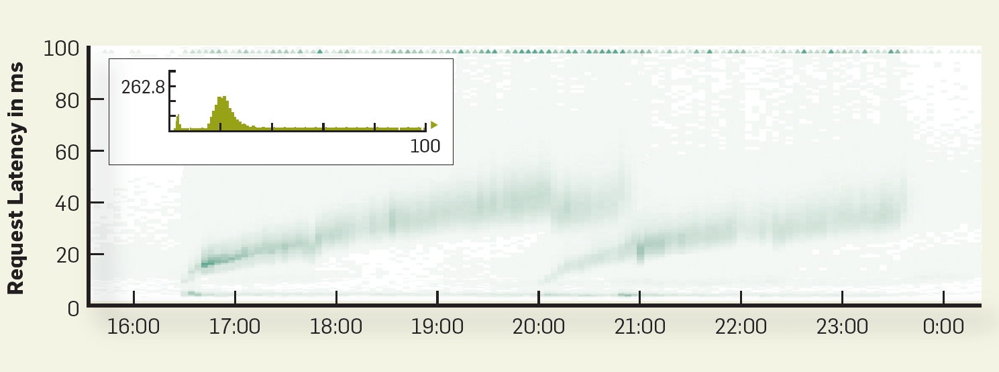

```{r, echo=FALSE, warning=FALSE, message=FALSE}
library(ggplot2)
library(ggmap)
library(PogromcyDanych)
library(PogromcyDanych)
library(maptools)
library(rgeos)
```

## ggplot2

https://ggplot2.tidyverse.org/
https://r4ds.had.co.nz/data-visualisation.html


Składnia do rysowania wykresów:

ggplot(data = <DATA>) + 
   <GEOM_FUNCTION>(mapping = aes(<MAPPINGS>))

dla przykładu 
```{r}
avocado <- read.csv("../avocado.csv", colClasses = c("integer", "character", "numeric", "numeric", "numeric", "numeric", "numeric", "numeric", "numeric", "numeric", "numeric","factor","integer","factor"))
avocado$Date <- as.Date(avocado$Date, "%Y-%m-%d")
av.sam <- avocado[sample(nrow(avocado), 1000),]
ggplot(data = av.sam) + 
  geom_point(mapping = aes(x = Date, y = AveragePrice))
```

```{r}
ggplot(data = av.sam) + 
  geom_point(mapping = aes(x = Date, y = AveragePrice, color = type))
```
```{r}
ggplot(data = av.sam) + 
  geom_point(mapping = aes(x = Date, y = AveragePrice, color = type, size = Total.Volume))
```
```{r}
ggplot(data = av.sam) + 
  geom_point(mapping = aes(x = Date, y = AveragePrice, color = type, size = Total.Volume, shape = region))
```

```{r}
ggplot(data = av.sam) + 
  geom_point(mapping = aes(x = Date, y = AveragePrice, color = type)) +
  geom_smooth(mapping = aes(x = Date, y = AveragePrice))
```

```{r}
ggplot(data = av.sam) + 
  geom_point(mapping = aes(x = Date, y = AveragePrice, color = type)) +
  geom_smooth(mapping = aes(x = Date, y = AveragePrice, linetype = type))
```


## Po co wizualizowa? dane

- Lepiej analizujemy obrazy ni? "suche" liczby
- Mo?na dostrzec pewne charakterystyki problemu, z kt?rym mamy do czynienia 
- Mo?na zauwa?y? potencjalne problemy
- Aby odnale?? dane odstaj?ce (np. b??dne)
- Aby podzieli? si? wynikami analizy z innymi - jeden obraz wart wi?cej ni? 1000 s??w ;)

## Po co wizualizowa? dane?
```{r, out.width = '300px', fig.align="center", echo=FALSE}
knitr::include_graphics("images/kwartet.png")
```

## Po co wizualizowa? dane?
Na poprzednim rysunku przedstawione by?y 4 r??ne zbiory danych, kt?re jednak mia?y takie same charakterystyki:

- ?rednia warto?? zmiennej "x" r?wna 9, ?rednia warto?? zmiennej "y" r?wna 7.5
- wariancja zmiennej "x" r?wna 11, wariancja zmiennej "y" r?wna 4.12
- korelacja obydwu zmiennych r?wna 0.816
- najlepiej dopasowany model regresji liniowej to $y=3+0.5x$

## Po co wizualizowa? dane?
```{r, echo=FALSE, warning=FALSE, message=FALSE}
xb <- c(rnorm(500,4,1), rnorm(30,25,3 ), rnorm(30,15,3 ))

dane <- data.frame(R = xb)
ggplot(dane, aes(xb)) + geom_histogram(bins=60) + geom_rug() + geom_vline(xintercept=mean(xb), color="red", lwd=1.5)
```

## Zasady tworzenia czytelnych wykres?w
- Przedstaw tylko to, co jest istotne, do tego w najprostszy mo?liwy spos?b
- U?ywaj sposobu prezentacji, kt?ry odczytujemy w spos?b precyzyjny
- Zweryfikuj, czy to co chcesz pokaza? jest czytelne dla postronnego odbiorcy


## Z?e wykresy
```{r, out.width = '200px', fig.align="center", echo=FALSE}

```

## Z?e wykresy
```{r, out.width = '200px', fig.align="center", echo=FALSE}

```

## Z?e wykresy
```{r, out.width = '200px', fig.align="center", echo=FALSE}

```

## Z?e wykresy
```{r, echo=FALSE}
W <- WIG
ggplot(W, aes(Data, Kurs.otwarcia)) + geom_line(color="red", lwd=2) + ylab("Kurs otwarcia") + ggtitle("Kurs otwarcia indeksu WIG") + ylim(0, 60000)
```


```{r, echo=FALSE}
rates = read.table(file="RequestRates.csv", sep=",", dec=".", header=FALSE)
rr = rates[,2]
```

## Jakiego wykresu potrzebuj??
Najpierw nale?y ustali?, co tak naprawd? chcemy zobaczy? na wykresie i odpowiedzie? sobie na pytania:

  - czy interesuj? nas konkretne warto?ci zmiennej, czy raczej ich rozk?ad?
  - czy dane zale?? od czasu, a je?li tak, to czy ta zale?no?? nas interesuje?
  - czy danych jest du?o, czy niewiele?
  - czy dane s? jedno-, czy wielowymiarowe?
  - i wiele innych...


## Histogram
- przedstawia rozk?ad naszej zmiennej
- pozwala dostrzec pewne struktury w naszych danych
- pomaga w wychwyceniu charakterystyki zmiennej
- przestawia w zasadzie tylko jeden wymiar problemu
- nie pokazuje zale?no?ci mi?dzy zmiennymi
- trzeba odpowiednio dobra? parametry, aby dosta? rozs?dn? informacj?

## Histogram
```{r, echo=FALSE}
ggplot(rates, aes(rr)) + geom_histogram(binwidth=500, color="green", fill="green") + ylab("Liczba") + xlab("Cz?sto?? zapyta?")
```

## Histogram
```{r, echo=FALSE}
ggplot(rates, aes(rr)) + geom_histogram(binwidth=100, color="green", fill="green") + ylab("Liczba") + xlab("Cz?sto?? zapyta?")
```

## Histogram
```{r, echo=FALSE}
ggplot(rates, aes(rr)) + geom_histogram(binwidth=20, color="green", fill="green") + ylab("Liczba") + xlab("Cz?sto?? zapyta?")
```

## Histogram
```{r, echo=FALSE}
ggplot(rates, aes(rr)) + geom_histogram(binwidth=5, color="green", fill="green") + ylab("Liczba") + xlab("Cz?sto?? zapyta?")
```

## Histogram
```{r, echo=FALSE}
ggplot(rates, aes(rr)) + geom_histogram(binwidth=1, color="green", fill="green") + ylab("Liczba") + xlab("Cz?sto?? zapyta?")
```


## Wykres liniowy
- przydatny je?li warto?? zmiennej zale?y od czasu
- nie pokazuje charakterystyki zbioru
- czytelny tylko wtedy, kiedy nie ma gwa?townych i chaotycznych zmian w czasie


## Wykres liniowy
```{r, echo=FALSE}
rates$offset = (rates$V1 - rates$V1[1])/3600
ggplot(rates, aes(offset, V2)) + geom_point() + geom_line(color="blue", size=1) + ylab("Liczba zapyta?") + xlab("Czas") + ggtitle("Cz?sto?? zapyta? do serwera (zapyta? na sekund?)") + ylim(0, 2500)
```

## Wykres liniowy
```{r, echo=FALSE}
W <- WIG
ggplot(W, aes(Data, Kurs.otwarcia)) + geom_line(color="red", lwd=2) + ylab("Kurs otwarcia") + ggtitle("Kurs otwarcia indeksu WIG")
```


## Scatter plot
- Wykres punktowy, przedstawia zale?no?? pomi?dzy zmiennymi
- bardzo przydatny je?li podejrzewamy, ?e zmienne s? skorelowane i chcemy to sprawdzi?
- pozwala na oszacowanie charakterystyki zmiennej, zachowuj?c informacje o korelacjach (w przeciwie?stwie do histogramu)
- pozwala na odnalezienie danych odstaj?cych

## Scatter plot
```{r, echo=FALSE}
multinode = read.table(file="ReqMultiNode.csv", sep=",", dec=".", header=FALSE)
ggplot(data=multinode, aes(V2, V3)) + geom_point() + ylab("Node 1") + xlab("Node 2") + ggtitle("Zajeto?? serwer?w 1 i 2")
```

## Scatter plot
```{r, echo=FALSE}
multinode = read.table(file="ReqMultiNode.csv", sep=",", dec=".", header=FALSE)
ggplot(data=multinode, aes(V2, sample(V3, replace=FALSE))) + geom_point() + ylab("Node 1") + xlab("Node 2") + ggtitle("Zajeto?? serwer?w 2 i 3")
```

## Prezentacja danych - przyk?ad

```{r, echo=FALSE, warning=FALSE, message=FALSE}
A <- auta2012 %>%
              filter(Rok.produkcji > 2000, Kraj.pochodzenia == "Polska") %>%
              select(Marka, Model, Rok.produkcji, Cena.w.PLN, Rodzaj.paliwa, Przebieg.w.km)
ggplot(A, aes(Rok.produkcji, Przebieg.w.km)) + geom_point() + ggtitle("Przebieg samochod?w w zale?no?ci od roku produkcji")
```

## Prezentacja danych - przyk?ad
- ze wzgl?du na obecno?? absurdalnie du?ej warto?ci, odstaj?cej od reszty, wykres jest nieczytelny
- warto?? ta jest najprawdopodobniej b??dem (przebieg kilkuletniego samochodu wi?kszy ni? 10 milion?w kilometr?w - nierealne)
- na kolejnym slajdzie wy?wietlimy krzyw? przybli?aj?c? ?rednie warto?ci przebiegu w zale?no?ci od roku produkcji samochodu

## Prezentacja danych - przyk?ad
```{r, echo=FALSE, warning=FALSE, message=FALSE}
A <- auta2012 %>%
              filter(Rok.produkcji > 2000, Kraj.pochodzenia == "Polska") %>%
              select(Marka, Model, Rok.produkcji, Cena.w.PLN, Rodzaj.paliwa, Przebieg.w.km)
ggplot(A, aes(Rok.produkcji, Przebieg.w.km)) + geom_smooth()
```

## Prezentacja danych
```{r, echo=FALSE, warning=FALSE, message=FALSE}
A <- auta2012 %>%
              filter(Rok.produkcji > 2000, Kraj.pochodzenia == "Polska", Przebieg.w.km<3000000) %>%
              select(Marka, Model, Rok.produkcji, Cena.w.PLN, Rodzaj.paliwa, Przebieg.w.km)
ggplot(A, aes(Rok.produkcji, Przebieg.w.km)) + geom_point(size=0.5) + geom_smooth() + ylim(0, 500000)
```

## Prezentacja danych

- Po odflitrowaniu odstaj?cych i z pewno?ci? b??dnych warto?ci, wykres nadal jest do?? ma?o czytelny
- zbyt du?o punkt?w, zmienna "x" jest dyskretna
- warto w takiej sytuacji zwizualizowac sobie zagregowane charakterystyki dla kolejnych warto?ci zmiennej "x"


## Prezentacja danych
```{r, echo=FALSE, warning=FALSE, message=FALSE}
A <- auta2012 %>%
              filter(Rok.produkcji > 2005, Kraj.pochodzenia == "Polska", Przebieg.w.km<3000000) %>%
              select(Marka, Model, Rok.produkcji, Cena.w.PLN, Rodzaj.paliwa, Przebieg.w.km)
ggplot(A, aes(as.factor(Rok.produkcji), Przebieg.w.km)) + geom_boxplot() + ylim(0, 500000)
```

## Prezentacja danych
```{r, echo=FALSE, warning=FALSE, message=FALSE}
ggplot(A, aes(Przebieg.w.km, fill=Rodzaj.paliwa)) + geom_histogram() + xlim(0, 300000)
```

## Prezentacja danych
```{r, echo=FALSE, warning=FALSE, message=FALSE}
ggplot(A, aes(as.factor(Rok.produkcji), fill=Rodzaj.paliwa)) + geom_bar()
```


## Prezentacja danych
```{r, echo=FALSE, warning=FALSE, message=FALSE}
K <- auta2012 %>%
  filter(Rok.produkcji > 2005, Przebieg.w.km<1000000, Cena<500000) %>%
  group_by(Rok.produkcji,Rodzaj.paliwa) %>%
  summarise(sredniaCena = mean(Cena.w.PLN, na.rm=TRUE),
            sredniPrzebieg = mean(Przebieg.w.km, na.rm=TRUE),
            liczba = n())

ggplot(K, aes(as.factor(Rok.produkcji), sredniPrzebieg, color=Rodzaj.paliwa)) + geom_point(size=4)
```


## Rozk?ady - histogram
- Losujemy po 100 pr?bek z rozk?adu Gaussa i z rozk?adu jednorodnego
- Poni?ej przedstawione s? one na dw?ch nieznacznie r??ni?cych si? wykresach
- Czy patrz?c na drugi z wykres?w byliby?my w stanie odgadn??, z jakich rozk?ad?w pochodz? nasze zmienne?


## Rozk?ady - histogram
```{r, echo=FALSE, warning=FALSE, message=FALSE}
x0 = rnorm(100)
y0 = 8*runif(100) - 2

dane <- data.frame(klasa = factor(rep(c("A","B"), each=100)), 
                   populacja = c(x0,y0))

ggplot(dane, aes(x=populacja, fill=klasa)) +
    geom_histogram(binwidth=0.2, alpha=0.5, position="identity")
```

## Rozk?ady - funkcja g?sto?ci rozk?adu
```{r, echo=FALSE, warning=FALSE, message=FALSE}
ggplot(dane, aes(x=populacja, fill=klasa)) + geom_density(alpha=0.6)
```

## Rozk?ady - histogram
- Kiedy pr?bek jest du?o (teraz 100000), jest znacznie ?atwiej

```{r, echo=FALSE, warning=FALSE, message=FALSE}
x1 = rnorm(100000)
y1 = 8*runif(100000) - 2
dane <- data.frame(klasa = factor(rep(c("A","B"), each=100000)), 
                   populacja = c(x1,y1))
ggplot(dane, aes(x=populacja, fill=klasa)) + geom_density(alpha=0.6)
```

## Rozk?ady - Q-Q plot
- Cz?sto potrzebujemy sprawdzi? (a przynajmniej upewni? si?), z jakiego rozk?adu pochodzi nasza zmienna
- Je?li mamy du?o pr?bek, rozk?ad mo?na rozpozna? (oczywi?cie w przybli?eniu) z histogramu lub wykresu g?sto?ci prawdopodobie?sta
- Je?li jednak pr?bek jest ma?o, warto obejrze? tzw. Q-Q plot pokazuj?cy nam jak si? maj? obserwowane kwantyle naszego rozk?adu do teoretycznych (z rozk?adu, z kt?rym por?wnujemy nasz? pr?b?)

## Rozk?ady - Q-Q plot
```{r, echo=FALSE, warning=FALSE, message=FALSE}
qqnorm(x0)
qqline(x0)
```

## Gdy pr?bek jest niewiele
```{r, echo=FALSE, warning=FALSE, message=FALSE}
qqnorm(y0)
qqline(y0)
```

## Gdy pr?bek jest niewiele
```{r, echo=FALSE, warning=FALSE, message=FALSE}
qqplot(y0, qunif(ppoints(length(y0)), min=-2, max=6))
abline(0,1, lwd="2", col="red")
```


## Mapy - Polska z Google Maps
```{r, warning=FALSE, message=FALSE}
pol.map <- get_map(location=c(lon=20, lat=52),
                   zoom=6, maptype="hybrid")
ggmap(pol.map)
```

## Mapy
- przy tworzeniu mapy trzeba pami?ta?, ?e opr?cz warto?ci zmiennej potrzebujemy wsp??rz?dnych, aby odpowiednie warto?ci zmiennej na?o?y? na odpowiednie miejsca na mapie
- dane zwykle trzeba wcze?niej skalibrowa? (w szczeg?lno?ci po wzgl?dem geometrycznym)
- dobrze dobrana skala jest tu bardzo istotna


## Mapy - po?udniowa Polska noc?
```{r, echo=FALSE, warning=FALSE, message=FALSE}
load('Earth.Rdata')
pol.map <- get_map(location=c(lon=20, lat=50), zoom=8, maptype="hybrid")
Earth$val.cut <- cut(Earth$val, breaks=c(0.1, 0.2, 0.4 ,0.8, 1.6, 3.2, 6.4, 12.8, 25.6,
                                            51.2, 102.4, 204.8)) 
colors <- colorRampPalette(c("#464646", "#002695","#0146FB", 
                             "#468F19", "#7AF231", "#BFB925","#FFF836", 
                             "#F08920", "#BC340E", "#EA4517", "#AAAAAA"))(length(levels(Earth$val.cut)))
ggmap(pol.map) + geom_raster(alpha = 0.5, data=Earth, aes(x=lon, y=lat, fill=val.cut), interpolate = TRUE) + scale_fill_manual(values=setNames(colors, levels(Earth$val.cut))) + coord_cartesian()
```

## Mapy - Krak?w i okolica noc?
```{r, echo=FALSE, warning=FALSE, message=FALSE}
pol.map <- get_map(location=c(lon=20, lat=50.05), zoom=12, maptype="hybrid")
Earth$val.cut <- cut(Earth$val, breaks=c(0.1, 0.2, 0.4 ,0.8, 1.6, 3.2, 6.4, 12.8, 25.6,
                                            51.2, 102.4, 204.8)) 
colors <- colorRampPalette(c("#464646", "#002695","#0146FB", 
                             "#468F19", "#7AF231", "#BFB925","#FFF836", 
                             "#F08920", "#BC340E", "#EA4517", "#AAAAAA"))(length(levels(Earth$val.cut)))
ggmap(pol.map) + geom_raster(alpha = 0.5, data=Earth, aes(x=lon, y=lat, fill=val.cut), interpolate = TRUE) + scale_fill_manual(values=setNames(colors, levels(Earth$val.cut))) + coord_cartesian()
```

## Ciekawe przyk?ady
Histogram zapyta? przedstawiony w postaci "mapy ciep?a"" (heatmap)
- za liczb? zlicze? odpowiada kolor s?upka

```{r, out.width = '300px', fig.align="center", echo=FALSE}

```

## Ciekawe przyk?ady
Sekwencja czasowa histogram?w (przedstawionych jako "mapy ciep?a")
- opr?cz og?lnej charakterystyki (rozk?ad bimodalny) widzimy te?, jak sytuacja zmienia?a si? w czasie
- znacznie wi?cej informacji ni? "zwyk?y" histogram

```{r, out.width = '300px', fig.align="center", echo=FALSE}

```

## Pakiety

https://vega.github.io/
https://seaborn.pydata.org/

https://developers.google.com/chart/

https://ggplot2.tidyverse.org/ 

## Inne wizualizacje

https://www.tableau.com/learn/articles/best-beautiful-data-visualization-examples

https://www.bloomberg.com/graphics/2015-whats-warming-the-world/
http://setosa.io/bus/
https://www.gapminder.org/
http://hint.fm/wind/index.html
https://podio.com/site/creative-routines
https://tgr.scdn2.secure.raxcdn.com/images/wysiwyg/_article/chances-of-dying.jpg
https://piktochart.com/data-visualization-examples/
https://www.nytimes.com/interactive/2015/03/12/world/middleeast/syria-civil-war-after-four-years-map.html?_r=1
http://map.norsecorp.com/#/
https://www.yahoo.com/amphtml/finance/news/exclusive-fitbits-150-billion-hours-heart-data-reveals-secrets-human-health-133124215.html?_guc_consent_skip=1541522463&guccounter=1

## ggplot

https://ggplot2.tidyverse.org/


